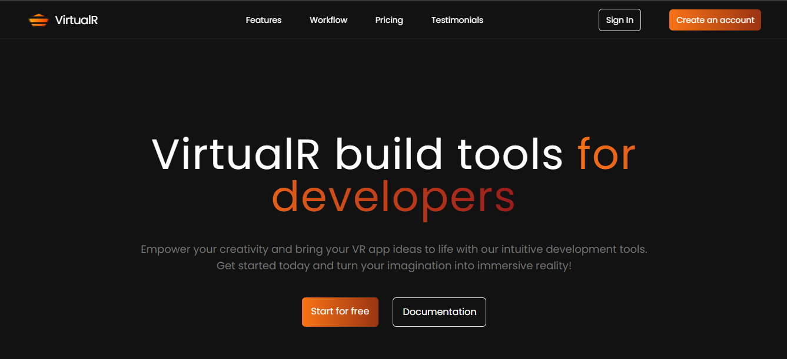

# 🌐 VirtualR - Build Tools for Developers

VirtualR is a modern and intuitive VR application development toolkit that empowers developers to bring immersive VR experiences to life.



## 🚀 Features

- Clean and modern UI built with React + Tailwind CSS
- Modular component structure
- Sections included: Hero, Features, Pricing, Testimonials, Workflow
- Responsive design
- Easy to customize

## 🧱 Tech Stack

- ⚛️ React (via Vite)
- 🎨 Tailwind CSS
- 🧪 JSX components

## 📦 Installation

```bash
# Clone the repository
git clone https://github.com/SahanWijerathne00/VirtualR-dev-tools---Frontend-Project.git

# Navigate into the project directory
cd virtualr-main(Your project folder)

# Install dependencies
npm install

# Start development server
npm run dev

